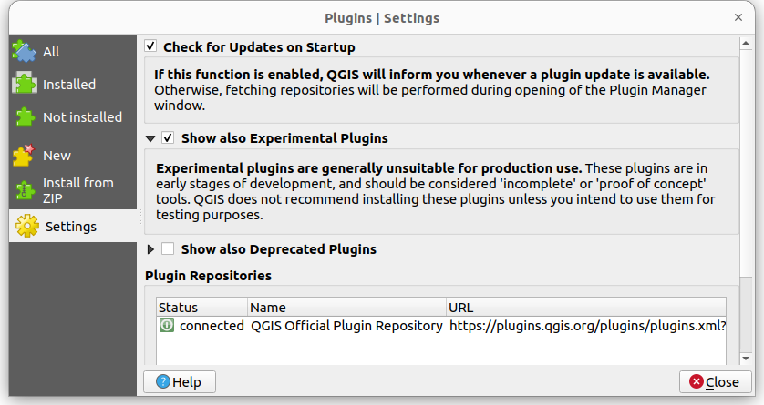
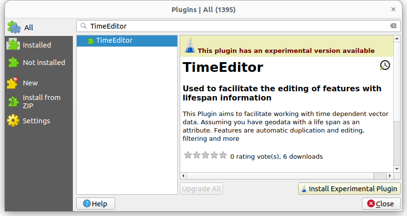
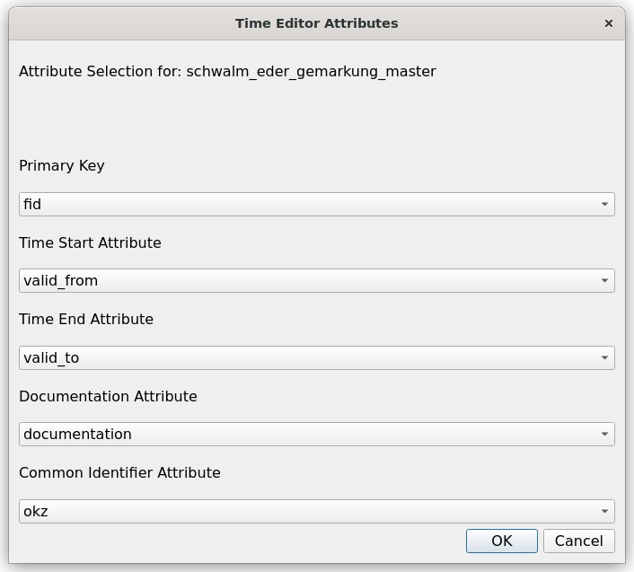
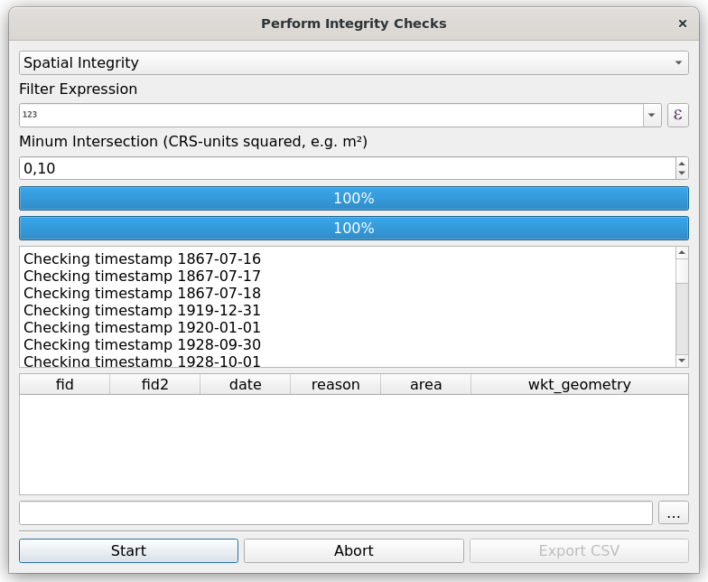
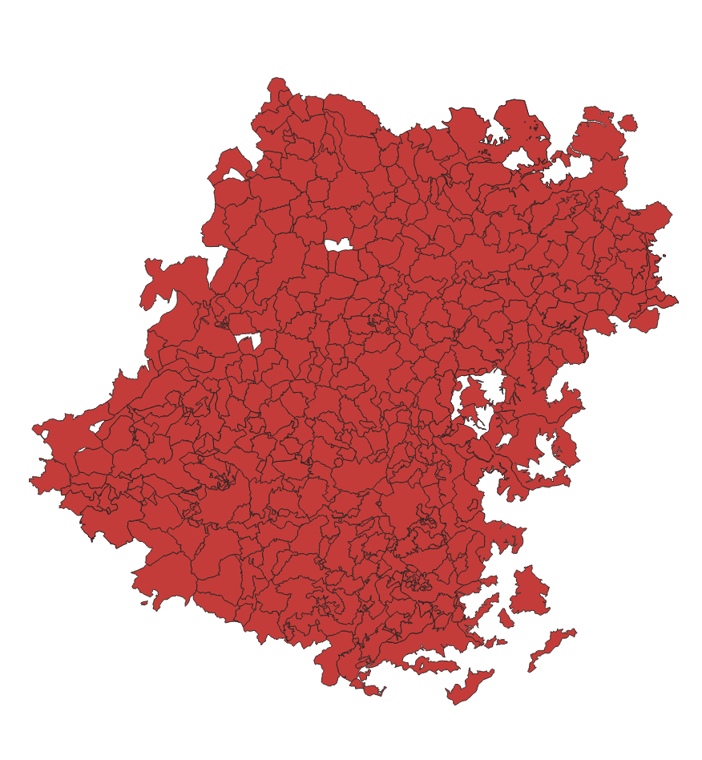
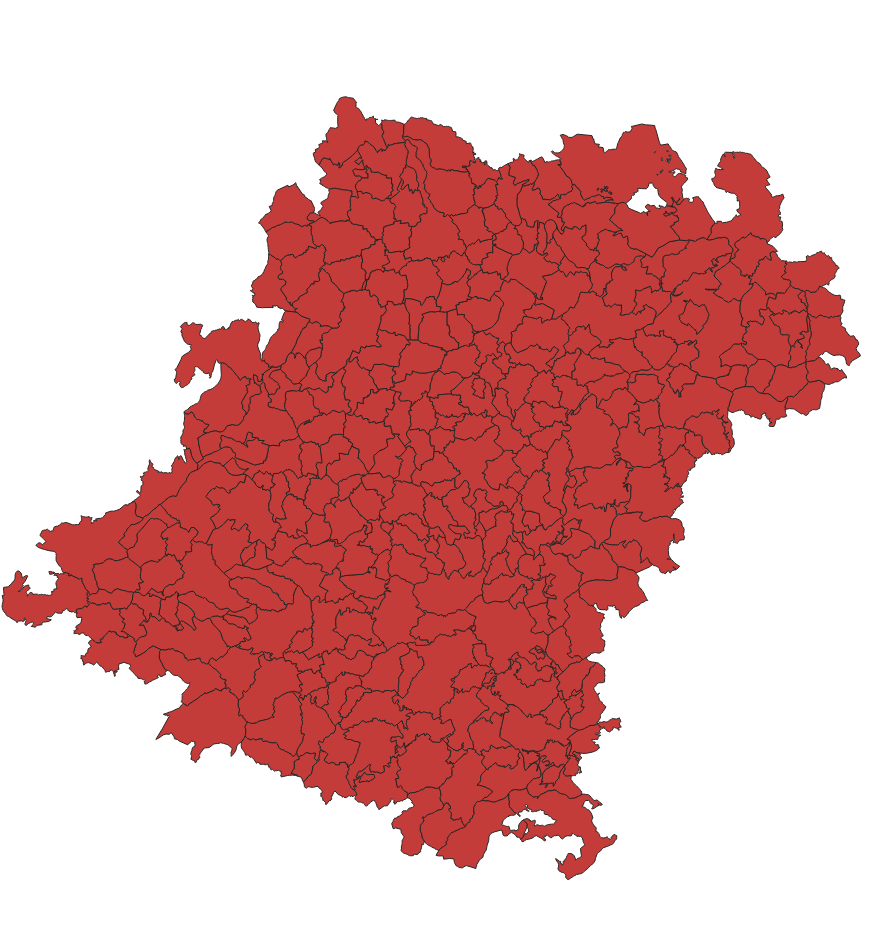

# Time Editor (QGIS Plugin)

Time Editor is a [QGIS](https://qgis.org/)-plugin to facilitate the editing of geometric features with 
time information encoded in its attributes. It provides workflows for editing and 
functions to check the spatial and temporal topology. 

It is developed at the [Hessische Institut für Landesgeschichte](https://hil.hessen.de) in 
order to reconstruct historical administrative boundaries. 

## Installation 

You can install the plugin via the official QGIS repository. Currently the plugin is still 
flagged as experimental so you will need to check the box in the settings to find it:

Now you can find the plugin by searching "Time Editor" in the QGIS repository. 

## How to use

### Sample Data 

We provide a sample data set to test this plugin with more complex historical data. You'll 
find a subset of our current historical boroughs dataset, licensed under [CC-BY-SA 4.0](https://creativecommons.org/licenses/by-sa/4.0/deed.en) [here](https://wms.hlgl.uni-marburg.de/public_downloads/schwalm_eder_gemarkung_master.zip)

### First time setup

After installation the plugin can be found under `Vector -> Time Editor`. You will need to select 
the Vector Layer you want to edit. The first time the Time-Editor starts it will ask you for 
the attribute field names for the primary key, the datestamp attributes, the documentation and 
the common identifier. If you use the sample dataset fill in the fields as in the following 
screenshot: 

### Data integrity checks 

Once you have completed the basic setup you can perform integrity checks with `Vector -> Time Editor -> Inspect Layer`. The following image shows how the check works. It will iterate over all 
unique timestamps in the layers features. For each of those timestamps it will filter the features 
and  check for intersections between the subset. By default it will ignore small intersections under 0.1 square map units.  

### Filtering 

Using `Vector -> Time Editor -> Filter Date` you can provide a datestring to filter all features 
to a specific timestamp. The following pictures illustrates the result for the value `1920-01-01` and `1930-01-01`: 

## Image Credit 

The Time-Editor Logo is heavily based on the Material Icons [Update](https://fonts.google.com/icons?selected=Material%20Symbols%20Outlined%3Aupdate%3AFILL%400%3Bwght%40400%3BGRAD%400%3Bopsz%4024) and 
[edit](https://fonts.google.com/icons?selected=Material%20Symbols%20Outlined%3Aupdate%3AFILL%400%3Bwght%40400%3BGRAD%400%3Bopsz%4024) released 
under [Apache 2.0](https://www.apache.org/licenses/LICENSE-2.0.html). 
